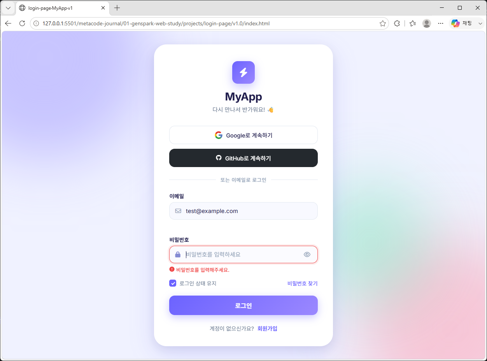
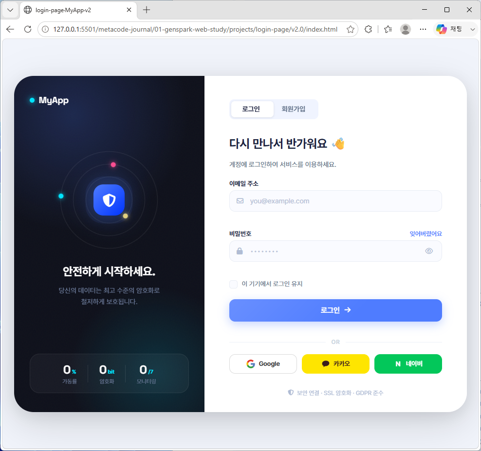
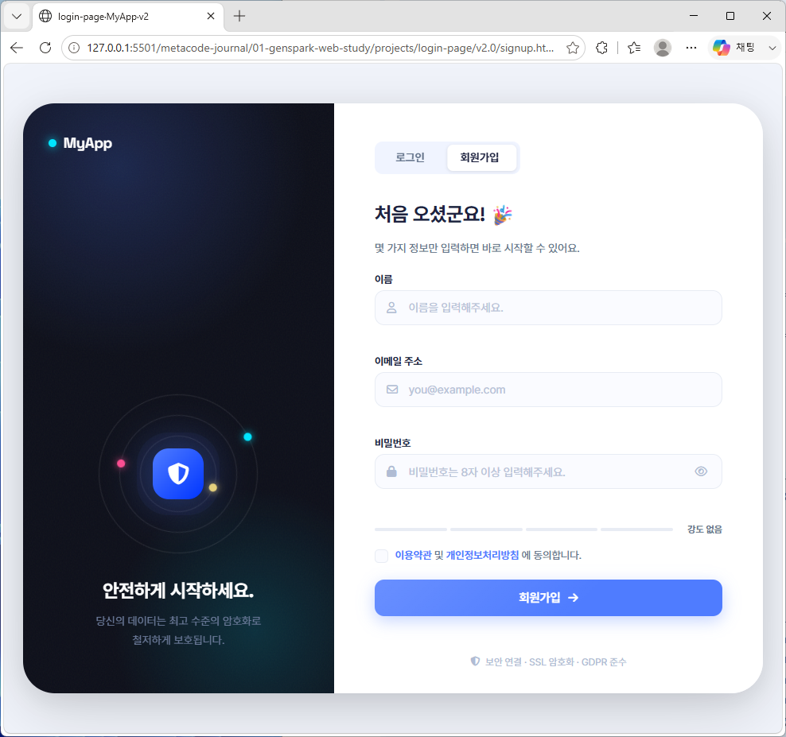
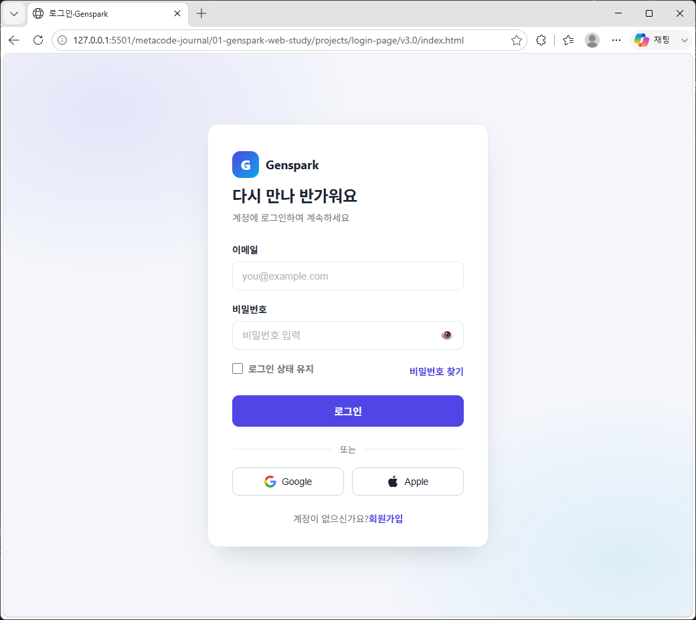
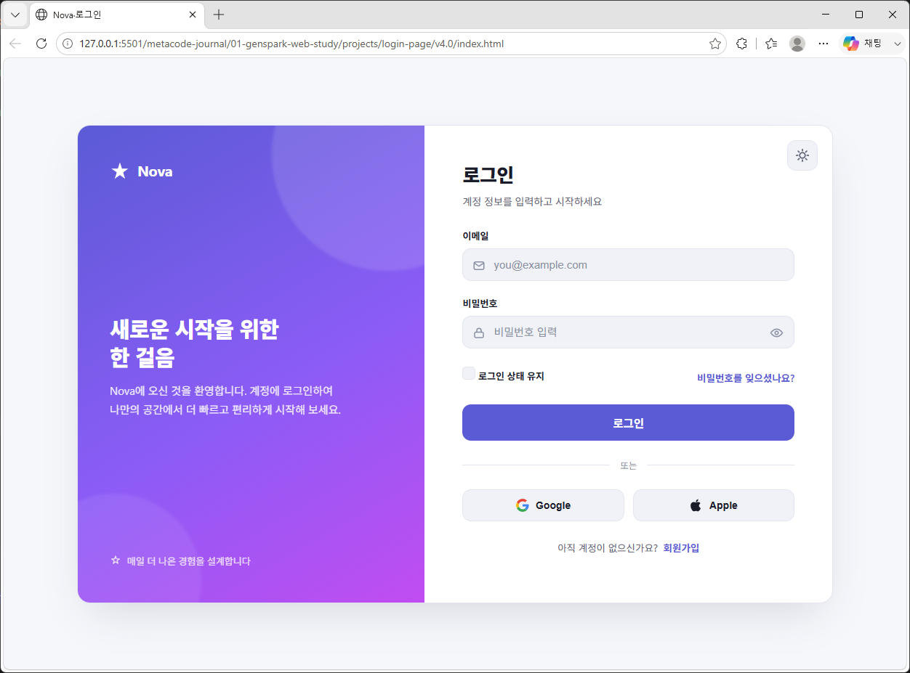

# 로그인 페이지 시안 (v1.0 ~ v4.0 기반)











---

## 데모 계정 (테스트용)

| 이메일 | 비밀번호 |
|--------|----------|
| `demo@myapp.com` | `demo1234` |
| `test@example.com` | `test5678` |

---

## 프로젝트 개요

이 프로젝트는 **젠스파크(Genspark)**를 통해 제공받은 웹 디자인 시안(v1.0 ~ v4.0)을 실습용으로 구현한 미니 프로젝트 입니다. 본 문서는 **v1.0 ~ v4.0 시안 기반 로그인 페이지**의 README이며, **다른 버전들도 동일한 방식(HTML · CSS · JavaScript)으로 제작**되었습니다.

---

## 프로젝트(v1.0 ~ v4.0)의 목적

v1.0 ~ v4.0 시안은 전체 디자인 시안 중 가장 기본적인 구조를 가진 버전으로, 로그인 UI의 핵심 요소를 중심으로 구성되어 있습니다. 본 프로젝트는 해당 시안을 코드로 구현하며 다음 목표를 달성하고자 했습니다.

- HTML · CSS · JavaScript 만으로 완성도 높은 UI 구현 연습
- 버전별 디자인 차이를 코드 구조로 어떻게 반영할지 실험
- 반응형, 접근성, 인터랙션 등 프론트엔드 기본기 강화
- 실제 서비스 제작 시 필요한 컴포넌트 구조화 경험 

---

## 완성된 기능

| 기능 | 설명 |
|------|------|
| 이메일 / 비밀번호 로그인 폼 | 입력 이벤트 기반 실시간 유효성 검사 (blur & submit) |
| 비밀번호 표시/숨기기 | 눈 아이콘 토글 버튼으로 input type 전환 |
| 로그인 상태 유지 | localStorage를 통한 이메일 저장 및 자동 복원 |
| 소셜 로그인 버튼 | Google / GitHub UI 제공, 토스트 안내 메시지 표시 |
| 로딩 스피너 | 제출 중 버튼 로딩 상태 및 비활성화 처리 |
| 토스트 메시지 | 성공 / 실패 / 안내 세 가지 타입의 피드백 제공 |
| 카드 흔들기 애니메이션 | 로그인 실패 시 shake 효과로 시각적 피드백 |
| 반응형 레이아웃 | 모바일(480px↓) 최적화 및 유연한 레이아웃 구성 |
| 접근성 | aria-label, aria-live, role="alert" 등 접근성 속성 적용 |
| 배경 블롭 애니메이션 | 부드러운 float 효과의 컬러 블롭 배경 구현 |

---

## 기본 파일 구조

```
index.html        ← 메인 페이지
style.css         ← 모든 스타일 (CSS 변수, 애니메이션 포함)
main.js           ← 인터랙션 & 유효성 검사 로직

```

---