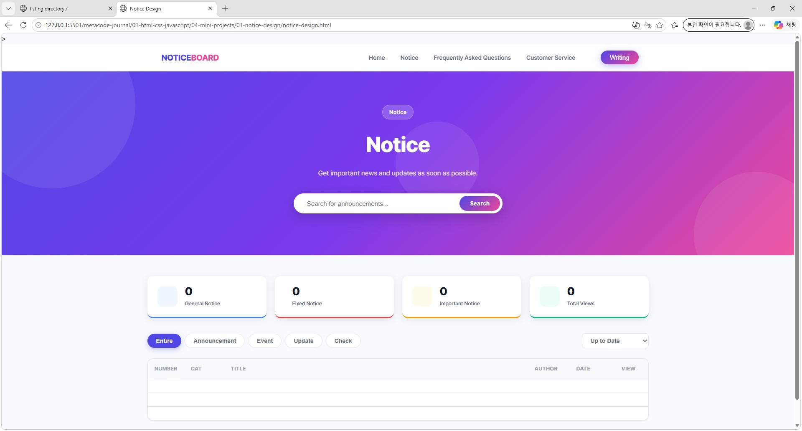

# 📢 홈페이지 공지사항 디자인 시안

홈페이지 공지사항 구현을 위한 **디자인 참고 시안** 프로젝트입니다.
실제 서비스에 바로 적용하거나, UI/UX 참고 자료로 활용할 수 있습니다.

---

## ✅ 구현된 기능

| 기능 | 설명 |
|------|------|
| **히어로 배너** | 그라데이션 배경 + 공지 검색 폼 |
| **통계 카드** | 전체 공지 수, 고정 공지, 중요 공지, 총 조회수 애니메이션 표시 |
| **카테고리 필터** | 전체 / 공지 / 이벤트 / 업데이트 / 점검 탭 버튼 |
| **정렬** | 최신순 / 오래된순 / 조회수순 드롭다운 |
| **고정 공지 카드** | 상단에 카드 형태로 핀된 공지 별도 표시 |
| **공지사항 목록 테이블** | 번호·분류·제목·작성자·등록일·조회수 컬럼 |
| **페이지네이션** | 5건 단위 페이징, 첫/끝/이전/다음 |
| **공지 상세 모달** | 클릭 시 상세 내용, 이전글/다음글 네비게이션 |
| **글쓰기 모달** | 분류, 제목, 작성자, 내용, 고정/중요 옵션, 등록 API 연동 |
| **실시간 검색** | 제목·내용 텍스트 검색 |
| **Toast 알림** | 등록 성공·실패·정보 알림 |
| **반응형** | 모바일/태블릿/데스크톱 대응 |
| **키보드 접근성** | ESC 닫기, Enter 행 선택 |

---

## 📂 01-notice-design 파일 구조

```
notice-design.html          메인 페이지 (공지사항 UI 전체)
notice-design.css           전체 스타일 (CSS 변수, 반응형 포함)
notice-design.js            데이터 로드·렌더링·이벤트 로직
```

---

## 🗄️ 데이터 모델 (`notices` 테이블)

| 필드 | 타입 | 설명 |
|------|------|------|
| `id` | text | 고유 식별자 |
| `category` | text | 공지 / 이벤트 / 업데이트 / 점검 |
| `title` | text | 공지 제목 |
| `content` | rich_text | 공지 내용 |
| `author` | text | 작성자 |
| `is_pinned` | bool | 상단 고정 여부 |
| `is_important` | bool | 중요 공지 여부 |
| `view_count` | number | 조회수 |
| `date` | text | 등록일 (YYYY-MM-DD) |

---

## 🎨 디자인 특징

- **Color Scheme**: Indigo(#4F46E5) + Pink(#EC4899) 그라데이션 포인트
- **타이포그래피**: Pretendard 폰트
- **컴포넌트**: 카드형 통계, 배지, 모달, Toast, 스켈레톤 로딩
- **애니메이션**: 통계 카운트업, 모달 슬라이드인, 스켈레톤 shimmer

---

## 🚀 다음 단계 추천

- [ ] 공지사항 수정·삭제 기능 추가
- [ ] 관리자 권한 분리 (일반 사용자 vs 관리자 뷰)
- [ ] 첨부파일 업로드 UI
- [ ] 댓글/반응 기능
- [ ] 다크모드 지원
- [ ] 브랜드 색상·로고 커스터마이징