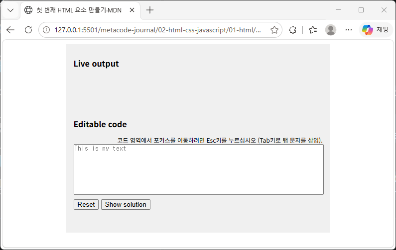

# Learning Notes

.png)
.png)
> 학습 과정에서 새롭게 이해한 개념과 시행착오를 기록합니다.

---

## [20260924-Thursday / 작성 예시]

## 오늘 배운 내용

index.html
- div 태그의 사용법(요소를 묶는 태그)
- css 클래스 사용법(index.html에서 class를 작성하여 사용합니다.)
- <textarea></textarea> 사용법(placeholder와 id=code를 사용해 예시 입력방법과 자바스크립트의 연동을 같이 사용하는 방법과 textarea 태그를 통해 css 클래스에서 resize: none;를 꼭 사용해야 입력창을 고정시킬 수 있었습니다.)
- input 태그의 사용법(입력창 태그로 id[자바스크립트 DOM 요소]와 type을 통해 버튼을 생성하고 value를 통해 버튼 안의 명칭을 작성할 수 있었습니다.) 

style.css
- body, p와 같은 큰 태그를 설정하는 방법(body는 페이지의 기본 스타일로 사용됩니다.)
- .으로 시작되는 class 명칭은 index.html 화면에 작성된 기본 뼈대를 레이아웃을 기준으로 꾸며줍니다.
- input 태그에서 type을 기준으로 index.html을 꾸며주기 위해서는 input[type="text"]로 작성하면 input 태그의 타입의 뼈대를 꾸밀 수 있었습니다.

script.js
- MDN이라는 사이트를 기준으로 v1.0의 index.html 뼈대를 제작했는데 현재 자바스크립트의 발전과 업데이트로 var 버전은 치명적인 오류를 발생하는 DOM 요소라서 사용을 권장하지 않는다고 알고 있었습니다. 하지만 사이트에서는 과거의 작업물을 수정하지 않아서 var 변수를 그대로 사용하였고 큰틀로 자바스크립트의 기능 주석을 나누는 방법을 알아서 주석을 나누고 적용하였습니다. (내용은 그대로 가지고와 사용했습니다.)

---

## 새롭게 이해한 개념
div 태그의 type="text" 입력창에서 index.html의 textarea라는 태그가 div 태그의 type="text"보다 id 요소의 값을 적용하는데 유익하다는 것을 알게 되었습니다. 처음에 textarea말고 div 클래스의 type을 text로 설정하여 placeholder를 "This is my text"라고 작성했습니다. 문제는 placeholder을 따로 분리해서 작성된 예시를 왼쪽 위로 정렬을 시켜보려고 하니 css에서 적용되지 않는 방식 때문에 애를 먹었는데 이유가 태그의 잘못된 사용법이었습니다.

그 다음으로 <button> 태그를 사용했는데 <input> 태그를 사용해야 id의 속성값과 type을 통한 버튼 설정, value를 통한 자바스크립트의 기능 적용이 가능하다는 것을 알게 되었습니다.

즉, HTML의 뼈대를 이해하기 위해서는 태그의 올바른 사용방법과 태그의 역할을 이해하는 것이 중요하다는 것을 알게된 작업이었습니다.

---

## 실습 내용(문제 풀이 과정)

https://app.notion.com/p/index-html-3e690e2dc53980b4a39be65533c77585

---