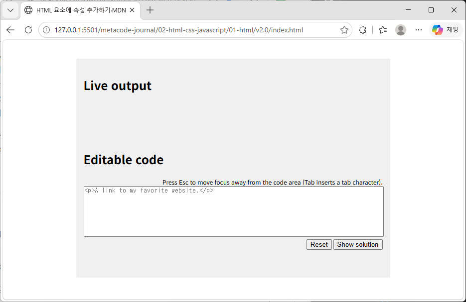

# Learning Notes

.png)
.png)
> 학습 과정에서 새롭게 이해한 개념과 시행착오를 기록합니다.

---

## [20260926-Sunday / 작성 예시]

## 오늘 배운 내용

script.js
var 변수를 const와 let으로 수정하는 방법을 배웠습니다. 자바스크립트는 기능들이 순서대로 실행되며 const에서 오류가 생기면 let으로 수정해야 한다는 것을 한 번더 깨달았습니다. 전 Gemini 플랫폼을 사용해 var 변수를 const와 let으로 변경할 때 어려움이 생겼는데 MDN 사이트에서 제공하는 연습용 예제인 html을 통해서 v2.0 시안을 만들었습니다. 이 작업으로 var 변수를 const로 변경할 때 자바스크립트의 기능 실행 과정 속에 코드의 큰 변화가 생기지 않는다는 걸 알게 되었습니다.

---

## 새롭게 이해한 개념
간단한 기능을 구현하는 var을 사용한 자바스크립트 기능 구현 코드는 var을 먼저 const로 변경하고 const에서 오류가 생기면 let으로 변경합니다. 예전에 문제점을 찾아서 고치고 이해했던 내용이지만 당시에 Gemini 플랫폼을 사용하면서 코드를 직접 작성하지 않아 이 내용이 크게 와닿지 못했습니다. 이번에는 직접 수정하는 과정에서 ChatGPT 플랫폼을 사용했는데 기능을 하나하나 알아가면서 공부하다보니 var을 const로 변경하고 오류가 생기면 let으로 변경해야 한다는 것을 이제야 이해하게 되었습니다. 

---