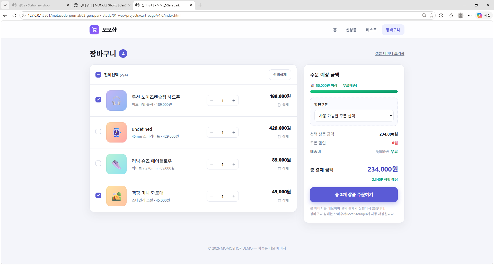
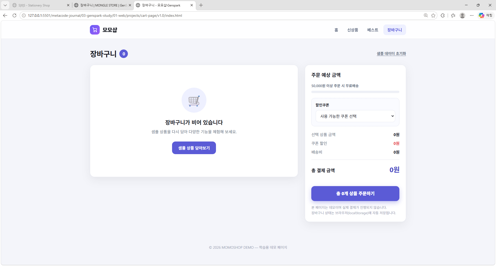
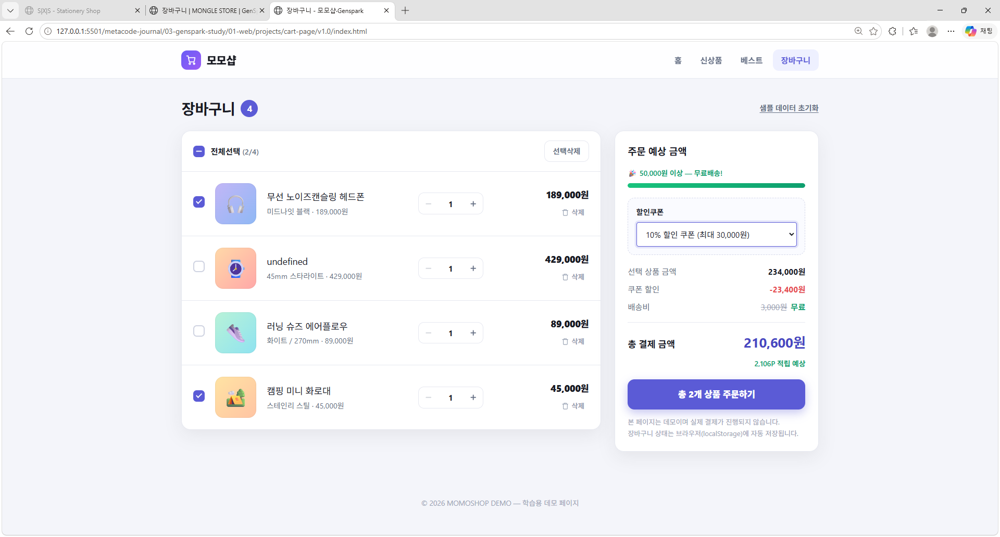
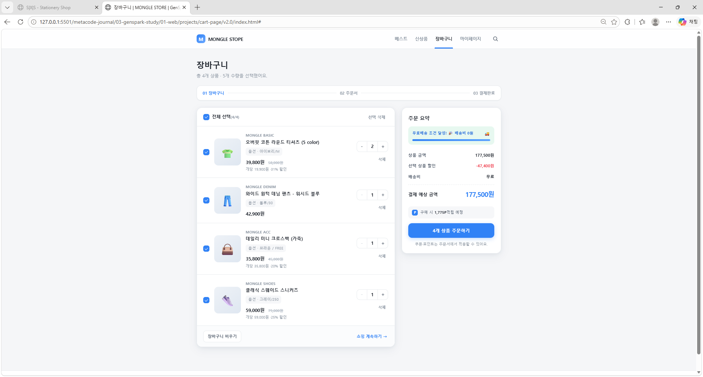
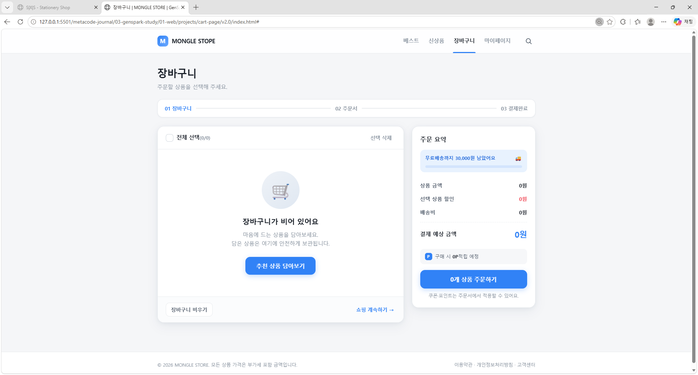
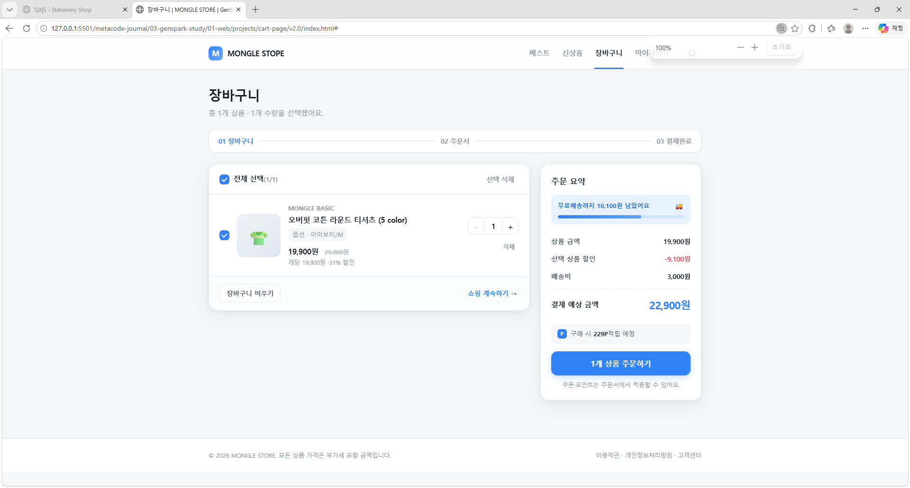
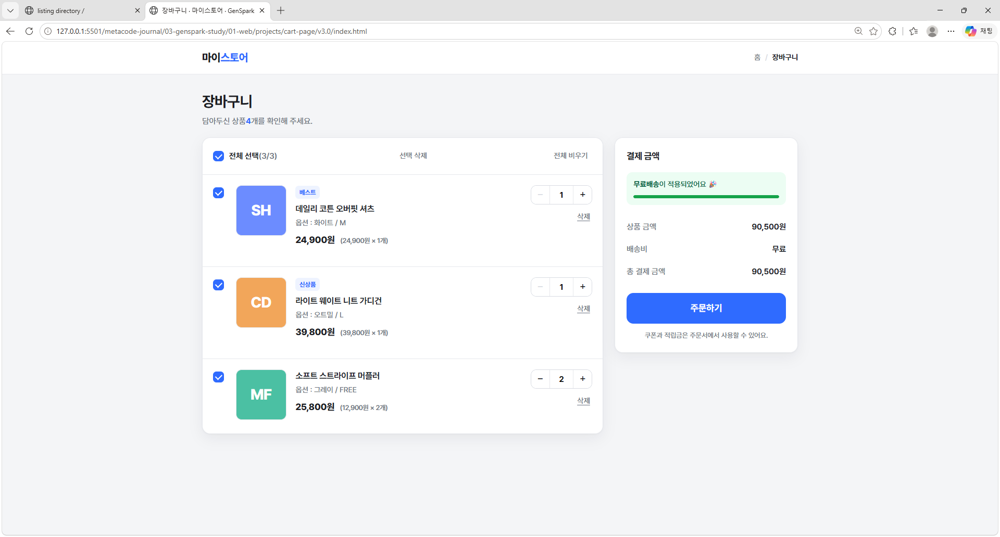
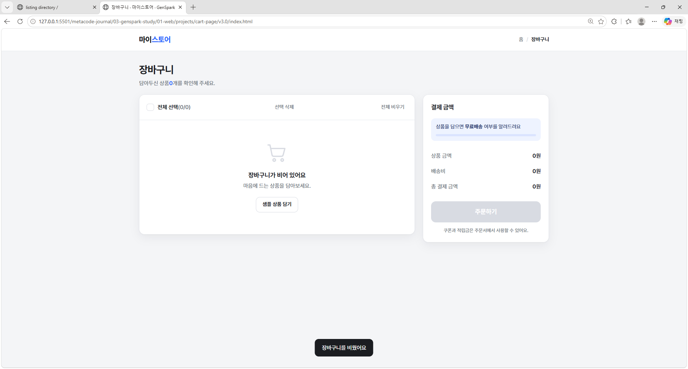
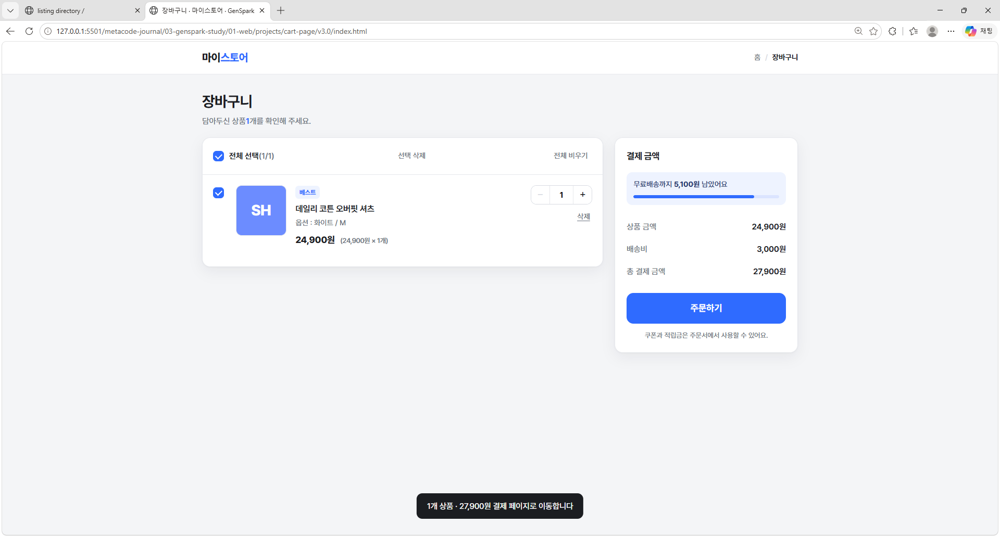

# 장바구니 페이지 시안 (v1.0 ~ v3.0 기반)

---

## 장바구니 페이지 시안 v1.0







---

## 장바구니 페이지 시안 v2.0







---

## 장바구니 페이지 시안 v3.0







---

## 프로젝트 개요

이 프로젝트는 **젠스파크(Genspark)**를 통해 제공받은 웹 디자인 시안(v1.0 ~ v3.0)을 실습용으로 구현한 미니 프로젝트 입니다. 본 문서는 **v1.0 ~ v3.0 시안 기반 장바구니 페이지**의 README이며, **다른 버전들도 동일한 방식(HTML · CSS · JavaScript)으로 제작**되었습니다.

---

## 프로젝트(v1.0 ~ v3.0)의 목적

v1.0 ~ v3.0 시안은 전체 디자인 시안 중 가장 기본적인 구조를 가진 버전으로, 회원가입 UI의 핵심 요소를 중심으로 구성되어 있습니다. 본 프로젝트는 해당 시안을 코드로 구현하며 다음 목표를 달성하고자 했습니다.

- HTML · CSS · JavaScript 만으로 완성도 높은 UI 구현 연습
- 버전별 디자인 차이를 코드 구조로 어떻게 반영할지 실험
- 반응형, 접근성, 인터랙션 등 프론트엔드 기본기 강화
- 실제 서비스 제작 시 필요한 컴포넌트 구조화 경험

---

## 기본 파일 구조

```
index.html        ← 메인 페이지
style.css / main.js 참조 파일
style.css         ← 모든 스타일 (CSS 변수, 애니메이션 포함)
main.js           ← 인터랙션 & 유효성 검사 로직

```

---

## 주요 기능

- **상품 목록 및 수량 조절**: `+`, `-` 버튼을 통한 직관적인 수량 변경 (최대 99개 제한)
- **실시간 결제 금액 산출**:
  - 선택 상품 금액 합산
  - 무료배송 기준(30,000원) 도달 여부에 따른 동적 배송비(3,000원) 및 프로그레스 바 갱신
- **체크박스 동기화**:
  - 개별 상품 선택에 따른 '전체 선택' 체크박스 및 선택 개수 카운트 실시간 반영
  - 일부 선택 시 `indeterminate` 상태 표현
- **장바구니 관리 액션**:
  - 선택된 상품 일괄 삭제
  - 장바구니 전체 비우기
  - 빈 장바구니 상태 표시 및 샘플 상품 복원 기능
- **사용자 피드백 (Toast)**:
  - 삭제, 복원, 주문 이동 시 애니메이션 토스트 알림 노출

---

## 기술 스택

- **HTML5**: 시맨틱 태그 기반 구조화
- **CSS3**: Flexbox, Custom Properties(CSS Variables), 미디어 쿼리
- **JavaScript (ES6+)**: 이벤트 위임(Event Delegation), 배열 고차 함수 기반 상태 관리

---