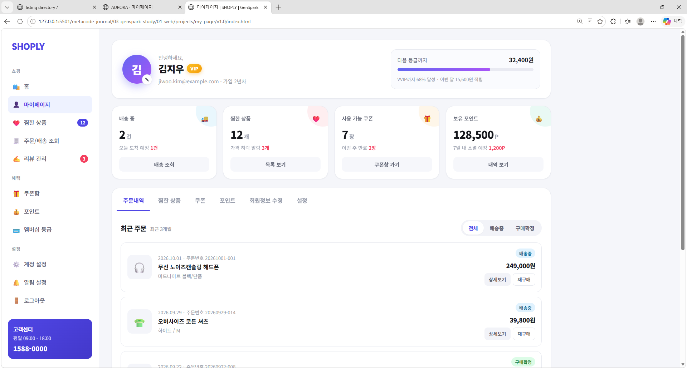
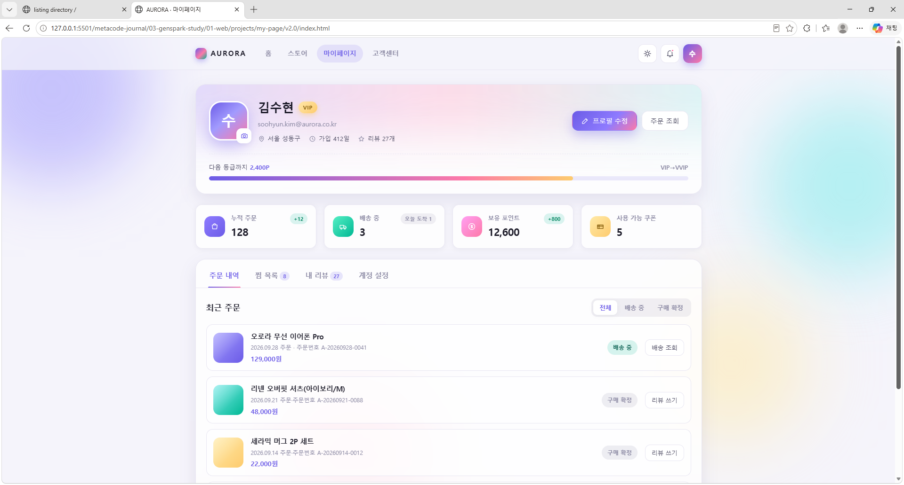
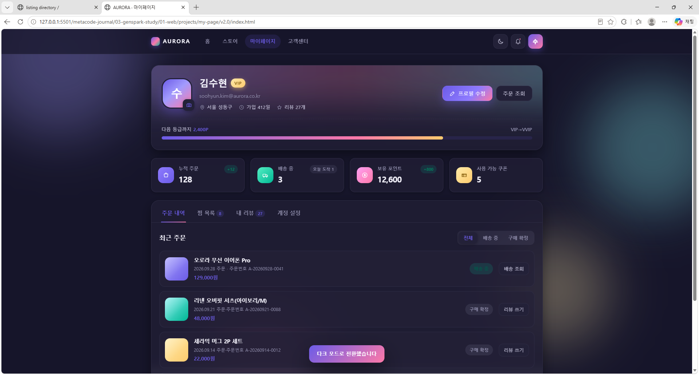

# 마이페이지 시안 (v1.0 ~ v2.0 기반)

---

## v1.0 - 시안 이미지 (SHOPLY)



---

## v2.0 - 시안 이미지 (AURORA)

**라이트 모드**



**다크 모드**



---

## 프로젝트 개요

이 프로젝트는 **젠스파크(Genspark)**를 통해 제공받은 웹 디자인 시안(v1.0 ~ v2.0)을 실습용으로 구현한 미니 프로젝트 입니다. 본 문서는 **v1.0 ~ v2.0 시안 기반 마이페이지**의 README이며, **모든 버전이 동일한 방식(HTML · CSS · JavaScript)으로 제작**되었습니다.

---

## 프로젝트(v1.0 ~ v2.0)의 목적

마이페이지는 프로필, 활동 요약, 주문 내역, 찜 목록, 계정 설정처럼 **여러 종류의 정보가 한 화면에 모이는 페이지**입니다. 본 프로젝트는 해당 시안을 코드로 구현하며 다음 목표를 달성하고자 했습니다.

- HTML · CSS · JavaScript 만으로 완성도 높은 UI 구현 연습
- 버전별 디자인 차이를 코드 구조로 어떻게 반영할지 실험
- 탭, 필터, 모달, 폼 검사 등 한 페이지 안의 여러 인터랙션 연결 연습
- 반응형, 접근성, 다크 모드 등 프론트엔드 기본기 강화

---

## 버전별 비교

| 구분 | v1.0 (SHOPLY) | v2.0 (AURORA) |
|------|---------------|---------------|
| 레이아웃 | 왼쪽 사이드바 + 본문 | 상단 바 + 가운데 정렬 카드 |
| 디자인 톤 | 화이트 · 인디고 포인트 | 글래스모피즘 · 오로라 그라데이션 블롭 |
| 탭 구성 | 주문내역 / 찜한 상품 / 쿠폰 / 포인트 / 회원정보 수정 / 설정 | 주문 내역 / 찜 목록 / 내 리뷰 / 계정 설정 |
| 데이터 렌더링 | JS 배열(`ORDERS`, `WISH`)로 목록 생성 | HTML에 직접 작성된 목록을 JS로 제어 |
| 모달 | 주문 상세 · 재구매 · 전체 삭제 · 회원 탈퇴 확인 | 프로필 수정 |
| 테마 | 라이트 모드 | 라이트 / 다크 모드 전환 + 저장 |

---

## 완성된 기능

### v1.0

| 기능 | 설명 |
|------|------|
| 주문 · 찜 목록 렌더링 | JS 데이터 배열을 템플릿 문자열로 변환해 목록 생성 |
| 탭 전환 + 인디케이터 | 활성 탭 아래 밑줄(ink)이 탭 위치·너비를 따라 이동, 창 크기 변경 시 재계산 |
| 요약 카드 → 탭 이동 | `data-tab-jump` 속성으로 카드 버튼에서 해당 탭 바로 열기 |
| 주문 필터 | 전체 / 배송중 / 구매확정 세그먼트 버튼 |
| 주문 상세 · 확인 모달 | 상세보기, 재구매, 찜 전체 삭제, 회원 탈퇴를 하나의 모달로 재사용 |
| 찜 목록 관리 | 장바구니 담기, 개별 삭제(페이드 아웃), 전체 삭제 |
| 회원정보 폼 검사 | 이름(한글 2자 이상) · 이메일 · 휴대폰 · 비밀번호 규칙을 `data-rule`로 연결 |
| 비밀번호 강도 미터 | 길이 · 영문+숫자 · 특수문자 기준 3단계 막대와 안내 문구 |
| 모바일 메뉴 | 햄버거 버튼으로 사이드바 열기/닫기, 배경(scrim) 클릭 시 닫기 |
| 토스트 메시지 | 저장 · 삭제 · 장바구니 담기 등 동작 결과 안내 |

### v2.0

| 기능 | 설명 |
|------|------|
| 다크 모드 | `<html data-theme>` 전환, localStorage 저장, 새로고침 후에도 유지 |
| 숫자 카운트업 | 통계 카드가 화면에 보이면(IntersectionObserver) 0 → 목표값까지 ease-out 애니메이션 |
| 탭 전환 | 클릭 + ← → 키보드 이동, `aria-selected` · `tabindex` · `hidden` 동기화 |
| 주문 필터 | 전체 / 배송 중 / 구매 확정, 결과가 없으면 빈 상태 문구 표시 |
| 찜 하트 토글 | `is-on` 클래스 전환 + 상태에 맞는 `aria-label`(찜하기 / 찜 해제) |
| 프로필 수정 모달 | ✕ · 취소 · Esc · 바깥 클릭으로 닫기, 열면 첫 입력칸 포커스, 닫으면 이전 위치로 포커스 복귀 |
| 프로필 저장 동기화 | 모달에서 저장한 이름 · 이메일을 프로필 카드, 아바타, 계정 설정 입력칸에 함께 반영 |
| 아바타 색 변경 | 카메라 버튼으로 아바타 그라데이션 색상 순환 |
| 계정 설정 폼 검사 | blur 시 검사, 오류 상태에서는 입력 중 실시간 재검사, 되돌리기 시 메시지 초기화 |
| 반응형 레이아웃 | 980px · 690px · 400px 구간별 그리드 열 수와 카드 배치 조정 |
| 접근성 | `role="tablist/tab/tabpanel"`, `aria-modal`, `aria-live`, `prefers-reduced-motion` 대응 |

---

## 기본 파일 구조

```
my-page/
├── README.md
├── img/
│   ├── preview-1.0.png   ← v1.0 시안 캡처
│   ├── preview-2.0.png   ← v2.0 라이트 모드 캡처
│   └── preview-2.1.png   ← v2.0 다크 모드 캡처
├── v1.0/
│   ├── index.html        ← 메인 페이지
│   ├── style.css         ← 모든 스타일 (CSS 변수, 애니메이션 포함)
│   └── script.js         ← 데이터 렌더링 · 인터랙션 · 유효성 검사 로직
└── v2.0/
    ├── index.html        ← 메인 페이지
    ├── style.css         ← 디자인 토큰(CSS 변수) · 다크 모드 · 반응형
    └── script.js         ← 인터랙션 · 유효성 검사 로직
```

---

## HTML · CSS · JS 연결 지점 (v2.0)

| 연결 | HTML | CSS | JavaScript |
|------|------|-----|------------|
| 테마 | `<html data-theme="light">` | `html[data-theme="dark"] { … }` | `root.setAttribute("data-theme", next)` |
| 탭 | `data-tab="wish"` / `id="panel-wish"` | `.tab.is-active`, `.panel[hidden]` | `"panel-" + data-tab`으로 패널 찾기 |
| 주문 필터 | `data-filter`, `data-status` | `.seg-btn.is-active` | 두 값을 비교해 `style.display` 변경 |
| 하트 | `class="heart is-on"` | `.heart.is-on`, `.heart.is-on .ico` | `classList.toggle("is-on")` |
| 폼 메시지 | `<p class="field-msg" data-for="inpName">` | `.field-msg.ok`, `input.is-invalid` | `.field-msg[data-for="…"]`로 찾아 문구 표시 |
| 카운트업 | `data-count="12600"` | `.stat-value` | `parseInt(getAttribute("data-count"))` |

---

## 트러블슈팅 기록 (v2.0)

| 증상 | 원인 | 해결 |
|------|------|------|
| 모달이 처음부터 떠 있고 닫히지 않음 | CSS 선택자 오타 `.modal-backedrop[hidden]` → `display: grid`가 `hidden`을 덮어씀 | `.modal-backdrop[hidden]`으로 수정 |
| 테마 저장이 안 되는데 에러도 없음 | `getltem` / `setltem` (l ↔ I 오타)이 `try/catch`에 묻힘 | `getItem` / `setItem`으로 수정 |
| 주문 필터를 눌러도 목록이 그대로 | 선택자 공백 누락(`#orderList.order-item`) + 대입 자리에 `===` 사용 | `"#orderList .order-item"`, `=`로 수정 |
| 하트 색이 바뀌지 않음 | `.heart.is-on`(같은 태그)과 `.heart .is-on`(자식) 혼동 | 같은 태그 클래스는 붙이고, 자식 요소 앞에만 공백 |
| `Assignment to constant variable` | 값을 다시 넣는 변수를 `const`로 선언 | `let`으로 변경 |
| 카메라 버튼이 모달까지 엶 | 같은 버튼에 클릭 리스너가 두 개 등록됨 | 모달 열기 버튼 배열에서 제외 |
| 되돌리기 후 이름이 처음 값으로 돌아감 | `form.reset()`은 `defaultValue`로 복원 | 저장 시 `value`와 `defaultValue`를 함께 갱신 |

---

## 기술 스택

- **HTML5**: 시맨틱 태그, `data-*` 속성, ARIA 역할 · 속성
- **CSS3**: Custom Properties(CSS 변수), Grid · Flexbox, `color-mix()`, `backdrop-filter`, 미디어 쿼리, keyframes 애니메이션
- **JavaScript (ES6+)**: IIFE 모듈 패턴, 이벤트 위임, `IntersectionObserver`, `requestAnimationFrame`, localStorage, 정규식 기반 폼 검사

---

## 실행 방법

각 버전 폴더의 `index.html`을 VS Code **Live Server** 등 로컬 서버로 열어 확인합니다.

```
my-page/v1.0/index.html
my-page/v2.0/index.html
```

> 수정 후 화면이 바뀌지 않으면 브라우저 캐시 때문일 수 있습니다. `Ctrl + Shift + R`(강력 새로고침)로 다시 불러오세요.

---
