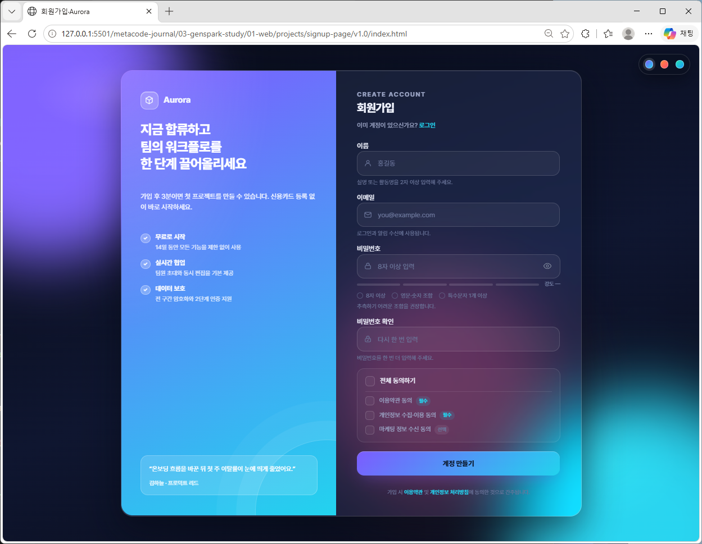
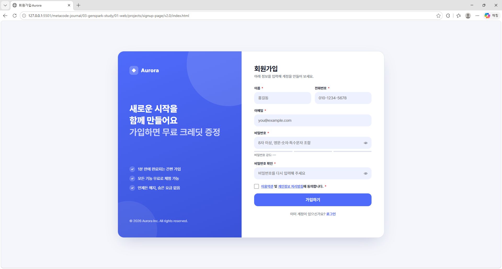

# 회원가입 페이지 시안 (v1.0 ~ v4.0 기반)

---

## 회원가입 페이지 시안 v1.0



---

## 회원가입 페이지 시안 v2.0



---

## 프로젝트 개요

이 프로젝트는 **젠스파크(Genspark)**를 통해 제공받은 웹 디자인 시안(v1.0 ~ v4.0)을 실습용으로 구현한 미니 프로젝트 입니다. 본 문서는 **v1.0 ~ v4.0 시안 기반 로그인 페이지**의 README이며, **다른 버전들도 동일한 방식(HTML · CSS · JavaScript)으로 제작**되었습니다.

---

## 프로젝트(v1.0 ~ v4.0)의 목적

v1.0 ~ v4.0 시안은 전체 디자인 시안 중 가장 기본적인 구조를 가진 버전으로, 회원가입 UI의 핵심 요소를 중심으로 구성되어 있습니다. 본 프로젝트는 해당 시안을 코드로 구현하며 다음 목표를 달성하고자 했습니다.

- HTML · CSS · JavaScript 만으로 완성도 높은 UI 구현 연습
- 버전별 디자인 차이를 코드 구조로 어떻게 반영할지 실험
- 반응형, 접근성, 인터랙션 등 프론트엔드 기본기 강화
- 실제 서비스 제작 시 필요한 컴포넌트 구조화 경험

---

## 완성된 기능

| 필드 | 검증 규칙 | 상태 표시 |
|------|------|------|
| 이름 | 2~30자 | 빈값 시 기본 안내, blur 후 검증, 통과 시 ✓ |
| 이메일 | RFC 스타일 정규식 /^[^\s@]+@[^\s@.]+(?:\.[^\s@.]+)+$/ | 통과 시 ✓, 형식 오류 시 ✗ + 안내문 |
| 비밀번호 | 8자 이상 + 영문 + 숫자 + 특수문자 1개 | 4단계 강도 바 + 규칙 체크리스트가 실시간으로 채워짐 |
| 비밀번호 확인 | 원본과 일치 | 입력 즉시 비밀번호 다시 검증 |
| 약관 동의 | 필수 2개 + 선택 1개 | 전체동기 인디터미네이트 상태, 미동의 시 빨간 테두리 |

---

## 기본 파일 구조

```
index.html        ← 메인 페이지
signup.html       ← index.html / style.css / main.js 참조 파일
style.css         ← 모든 스타일 (CSS 변수, 애니메이션 포함)
main.js           ← 인터랙션 & 유효성 검사 로직

```

---