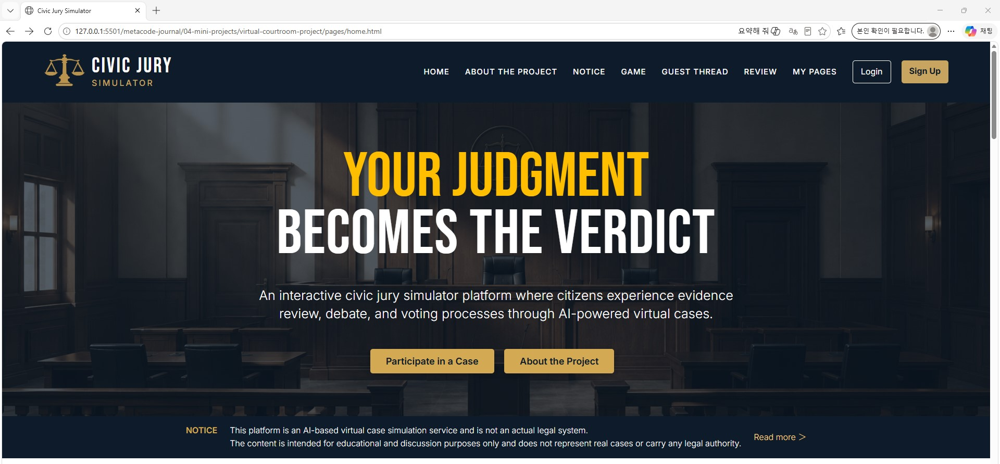
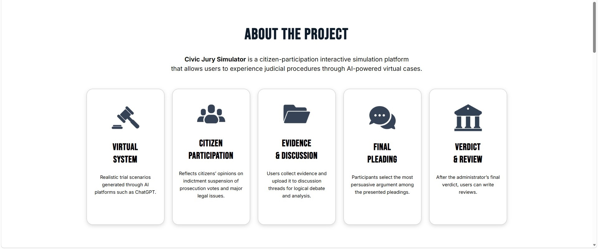
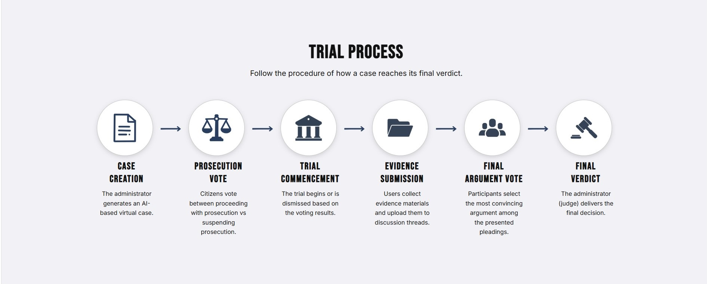
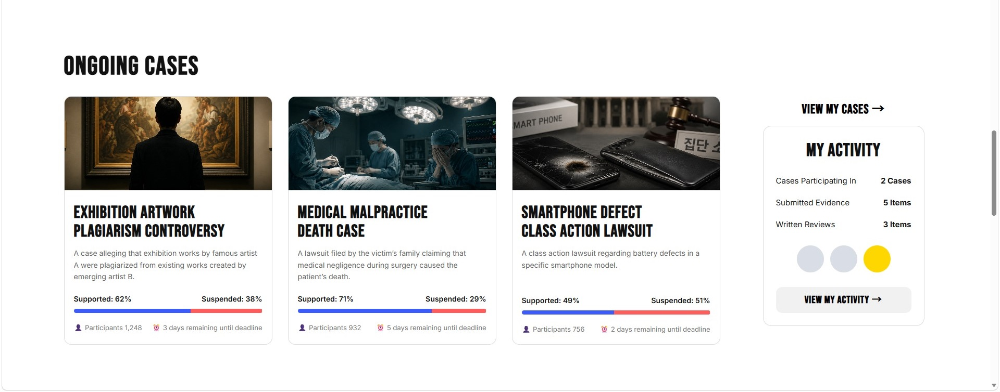
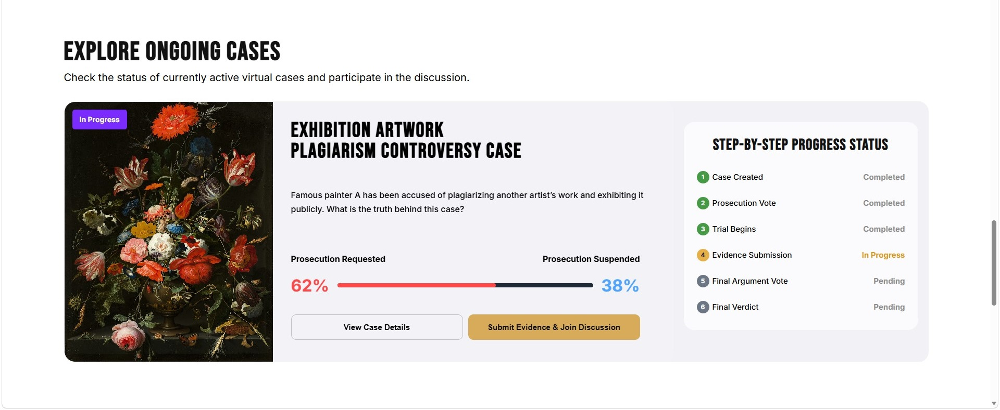
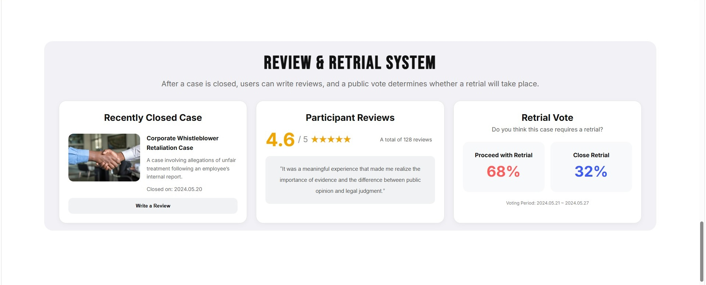
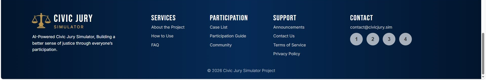

# Virtual Courtroom Project

A mini web project designed to simulate the process of a criminal lawsuit and courtroom experience through an interactive website interface.

This project was created as part of my frontend development learning journey using HTML, CSS, and JavaScript.

---









# Project Overview

The **Virtual Courtroom Project** is an experimental portfolio website that explores how legal procedures and storytelling can be transformed into an interactive web experience.

The goal of this project is not to create a real legal service, but to design a fictional and educational courtroom simulation system that helps users experience:

- Criminal complaint procedures
- Courtroom case flow
- Rule-based interaction systems
- Public discussion threads
- Review and feedback systems

---

# Main Pages
```plaintext
HOME - Sign Up / Login / Notification Center
│
├── About the Project - Project Vision and Purpose / Introduction and Objectives
│
├── Notice
│     │
│     ├── The Whole - General Notices
│     │
│     └── System Operator's Notice
│     │   │
│     │   ├── Case Occurrence Announcements (Pinned)
│     │   ├── Indictment Vote Result Announcements (Pinned)
│     │   │
│     │   └── General Operator Notices
│     │
│     └── A Written Judgment(Ai) - AI Judgment Releases
│         │
│         ├── Community Thread Judgment Guide (Pinned)
│         ├── Witness Statement Summary (Pinned)
│         ├── Reconstruction of the Incident Day (Pinned)
│         │
│         └── General AI Judgment Posts
│        
├── Game
│     │
│     ├── Game Rule
│     │   │
│     │   └── Introduction to the Gameplay Process
│     │       └── 7-Step Procedure
│     │
│     ├── Game Case
│     └── Game Case Results
├── Guest Thread
│     ├── An Indictment
│     └── Suspension Of Prosecution
├── Review
└── My pages
```

---

# Tech Stack - More to be added

- HTML5
- CSS3
- JavaScript / I need to learn.

---

# Folder Structure - More to be added

List of folders you are working on
```plaintext
virtual-courtroom-project/
│
├── assets
│     ├── img
│     └── readme
├── css
│     ├── home.css
│     ├── about-the-project.css
│     └── notice.css
├── js
├── pages
│     ├── home.html
│     ├── about-the-project.html
│     └── notice.html
└── README.md
```