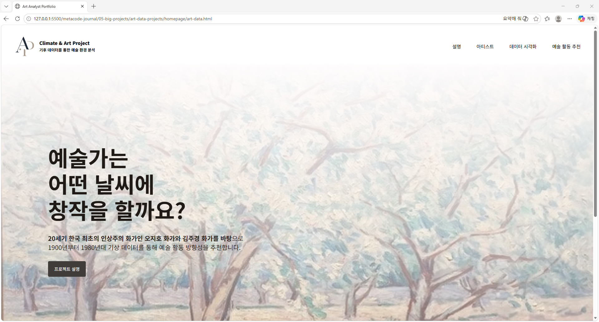
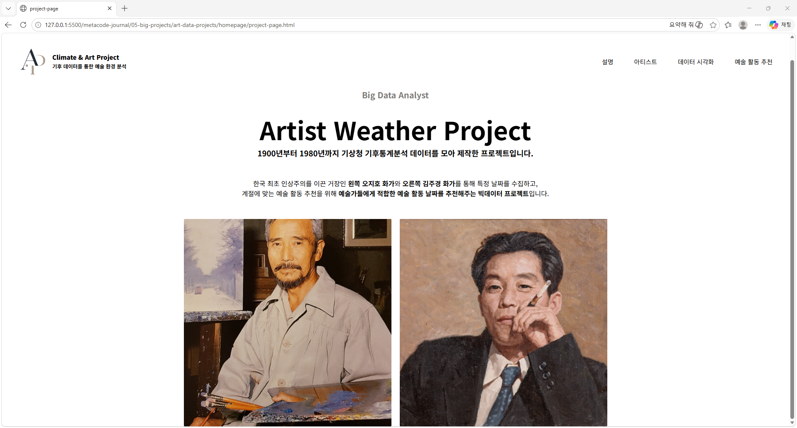

<!-- 대문 이미지 -->




# Art Climate Data Project

> 기후 데이터를 활용한 예술 창작 환경 분석 프로젝트  
> A project exploring artistic creation environments through climate data visualization and analysis.

---

## 📌 Project Overview

Art Climate Data Project는  
기후 데이터와 예술 창작 환경의 관계를 탐구하기 위한 데이터 기반 프로젝트입니다.

이 프로젝트는 단순한 데이터 시각화를 넘어,

- 기후 변화
- 계절과 환경
- 창작 활동의 조건
- 예술가의 감각 경험

등을 데이터 분석과 시각적 인터페이스를 통해 탐구하는 것을 목표로 합니다.

---

## 🎯 Project Goals

- 기후 데이터를 수집하고 분석하기
- 데이터 시각화를 통해 환경 변화를 직관적으로 표현하기
- 예술 창작 환경과 기후 요소의 관계 탐구하기
- 웹 인터페이스를 통해 데이터를 아카이빙하고 기록하기
- 데이터 기반 예술 프로젝트로 확장하기

---

## 🛠 Tech Stack

### Frontend
- HTML5
- CSS3

### Data Analysis
- Python
- Pandas
- Matplotlib
- Seaborn

### Development Tools
- Jupyter Notebook
- VS Code
- Git & GitHub

---

## 📂 Project Structure

```bash
art-data-projects/
├── homepage
│   ├── 01-data-page/                # 기후 데이터 파일 
│   ├── 02-jupyter-notebook-page/    # Jupyter 분석 파일
│   ├── 03-src-page/                 # 프로젝트 속성
│   └── 04-requirements-page/        # 프로젝트 조건 정리
│
├── img
│
├── main-art-data.css                 # 메인 페이지 CSS
├── main-art-data.html                # 메인 페이지 HTML
├── project-page.html                 # 프로젝트 소개 페이지 HTML
│
└── README.md
```

---

## 📊 Main Features

### 1. Climate Data Visualization
- 온도 변화 분석
- 계절 데이터 시각화
- 지역별 환경 데이터 비교

### 2. Artistic Environment Research
- 창작 환경과 기후의 관계 탐구
- 감각 경험과 데이터 연결
- 예술적 기록 아카이빙

### 3. Interactive Web Interface
- 스크롤 기반 인터랙션
- 시각 중심 웹 레이아웃
- 데이터 기반 UI 디자인

---

## 🌏 Project Vision

이 프로젝트는 데이터를 단순한 수치로 바라보지 않고,

"환경은 어떻게 인간의 감각과 창작에 영향을 미치는가?"

라는 질문을 중심으로 확장됩니다.

장기적으로는:

- 데이터 기반 예술 작업
- 인터랙티브 웹 전시
- 기후 아카이브 구축
- AI 기반 시각화 연구

등으로 발전시키는 것을 목표로 합니다.

---

## 📸 Preview

프로젝트 이미지 및 시각화 결과는 추후 업데이트 예정입니다.

---

## 🚀 Future Plans

- 인터랙티브 데이터 시각화 추가
- 지도 기반 환경 분석
- AI 이미지 생성 연동
- 웹 전시 형태로 확장

---

## 📖 Learning Journey

이 프로젝트는 개발과 데이터 분석을 학습하며 동시에 진행되는 개인 연구 프로젝트입니다.

현재:
- Python 데이터 분석 학습
- Pandas 기반 데이터 처리
- Seaborn 시각화
- HTML/CSS 웹 개발

등을 함께 공부하며 프로젝트를 발전시키고 있습니다.

---

## 🔗 GitHub

GitHub Repository:
(추후 링크 추가)

---

## 📌 Author

SOJEONG GI

Art / Data Visualization / Climate Archive / Creative Research
