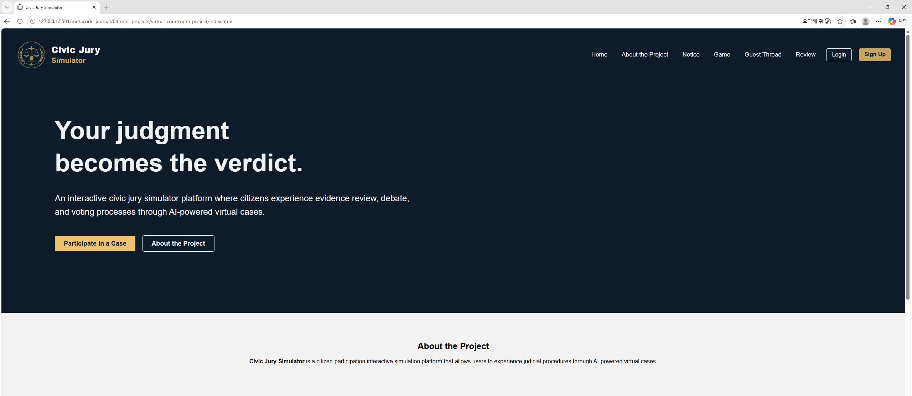

# Virtual Courtroom Project

A mini web project designed to simulate the process of a criminal lawsuit and courtroom experience through an interactive website interface.

This project was created as part of my frontend development learning journey using HTML, CSS, and JavaScript.

---


# Project Overview

The **Virtual Courtroom Project** is an experimental portfolio website that explores how legal procedures and storytelling can be transformed into an interactive web experience.

The goal of this project is not to create a real legal service, but to design a fictional and educational courtroom simulation system that helps users experience:

- Criminal complaint procedures
- Courtroom case flow
- Rule-based interaction systems
- Public discussion threads
- Review and feedback systems

---

# Main Pages

| Page | Description |
|------|-------------|
| Home | First impression and project introduction |
| Creator | Information about the creator |
| Project | Detailed explanation of the project |
| Notice | Announcements and updates |
| Game Rule | Rules of the courtroom simulation |
| Game Case | Interactive case scenarios |
| Guest Thread | Community discussion board |
| Game Case Results | Case outcome and result page |
| Review | User reviews and feedback |

---

# Tech Stack

- HTML5
- CSS3
- JavaScript (Vanilla JS)

---

# Folder Structure

```plaintext
virtual-courtroom-project/
│
├── index.html
├── pages/
├── css/
├── js/
├── assets/
├── components/
└── README.md